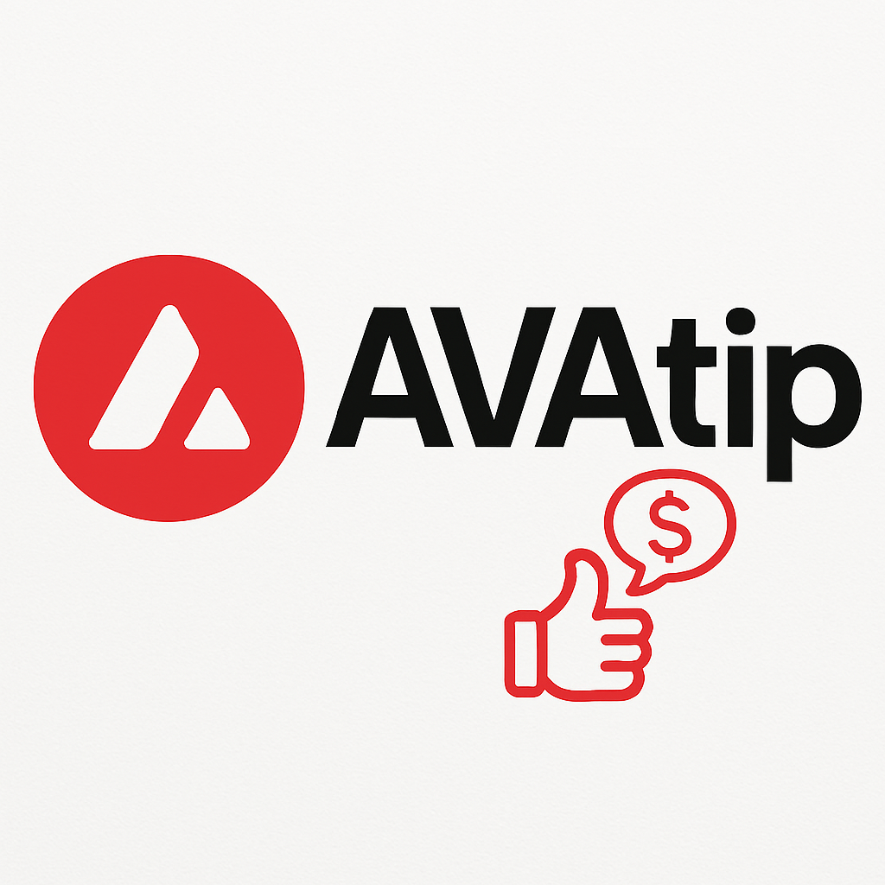

<div align="center">

# 🔺 AVAtip


</div>

<div align="center">
  
  
  
  
</div>

<div align="center">
  <h3>🚀 Turn Social Interactions into Instant Micropayments</h3>
  <p><em>Set-and-forget dApp that transforms every like, reply, and social action into seamless crypto rewards</em></p>
</div>

---

## 🌟 Vision

AVAtip revolutionizes social engagement by turning everyday interactions into instant micropayments on the Avalanche network. With our set-and-forget approach, users can automatically send micro-AVAX or any C-Chain token with every social action, making it possible for billions to earn their first crypto without ever buying it.

## ⚡ Core Features

### 🎯 **Set & Forget Automation**
- Configure once, reward forever
- Automatic micropayments on social actions
- Smart wallet permission management

### 🔗 **Multi-Platform Integration**
- Twitter/X integration
- Discord rewards
- Telegram tipping
- Universal social platform support

### 💎 **Token Flexibility**
- Native AVAX support
- Any Avalanche C-Chain token
- Custom reward configurations
- Dynamic amount settings

### 🎮 **Gamified Experience**
- Reward streaks and multipliers
- Social engagement leaderboards
- Achievement system
- Community challenges

## 🏗️ Technical Architecture

### **Blockchain Layer**
- **Network**: Avalanche C-Chain
- **Benefits**: Sub-second finality, low fees (<$0.01)
- **Smart Contracts**: Automated reward distribution
- **Wallet Integration**: MetaMask, Core Wallet, WalletConnect

### **Application Stack**
```
Frontend (React/Next.js) → API Layer → Avalanche C-Chain
     ↓                        ↓              ↓
Social Platform APIs ← Webhook System ← Smart Contracts
```

## 🎨 Design Philosophy

**Theme**: Cyberpunk meets DeFi minimalism
- **Colors**: Avalanche Red (#E84142), Cyber White, Deep Black
- **Style**: Clean, futuristic, high-contrast
- **Animations**: Smooth micro-interactions, particle effects
- **UX**: One-click setup, invisible complexity

## 🚀 Getting Started

### Prerequisites
- Node.js 18+
- MetaMask or Core Wallet
- Avalanche C-Chain testnet AVAX

### Quick Setup
```bash
# Clone the repository
git clone https://github.com/yourusername/avatip.git
cd avatip

# Install dependencies
npm install

# Set up environment
cp .env.example .env.local

# Start development server
npm run dev
```

## 📋 Development Roadmap

### Phase 1: Foundation 🏗️
- [ ] Project setup and architecture
- [ ] Smart contract development
- [ ] Basic UI/UX framework
- [ ] Wallet connection integration

### Phase 2: Core Features 🎯
- [ ] Social platform API integrations
- [ ] Automated tipping mechanisms
- [ ] Token selection and configuration
- [ ] User dashboard and analytics

### Phase 3: Gamification 🎮
- [ ] Reward streak system
- [ ] Leaderboards and achievements
- [ ] Community challenges
- [ ] Advanced analytics

### Phase 4: Scale & Polish ✨
- [ ] Multi-platform expansion
- [ ] Advanced automation rules
- [ ] Mobile app development
- [ ] Mainnet deployment

## 🤝 Contributing

We welcome contributions! Please see our [Contributing Guidelines](CONTRIBUTING.md) for details.

### Development Setup
1. Fork the repository
2. Create your feature branch (`git checkout -b feature/amazing-feature`)
3. Commit your changes (`git commit -m 'Add amazing feature'`)
4. Push to the branch (`git push origin feature/amazing-feature`)
5. Open a Pull Request

## 📄 License

This project is licensed under the MIT License - see the [LICENSE](LICENSE) file for details.

## 🔗 Links

- **Website**: [Coming Soon]
- **Documentation**: [Coming Soon]
- **Discord**: [Coming Soon]
- **Twitter**: [Coming Soon]

---

<div align="center">
  <p><strong>Built with ❤️ on Avalanche</strong></p>
  <p><em>Making crypto rewards as natural as social interaction</em></p>
</div>